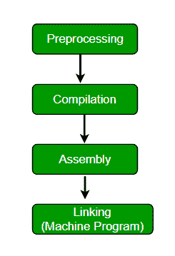

# 如何编写一个没有 main()的运行 C 代码？

> 原文:[https://www . geesforgeks . org/write-running-c-code-not-main/](https://www.geeksforgeeks.org/write-running-c-code-without-main/)

写一个 C 语言代码打印 **GeeksforGeeks** 没有任何主要功能。

从逻辑上讲，不使用 main()函数编写一个 C 程序似乎是不可能的。因为每个程序必须有一个 main()函数，因为:-

*   它是每个 C/C++ 程序的入口点。
*   所有预定义和用户定义的函数都是通过 main 直接或间接调用的。

因此，我们将使用预处理器(一个在编译前处理源代码的程序)指令#define 和参数，给人一种程序在没有 main 的情况下运行的印象。但实际上，它有一个隐藏的主要功能。让我们看看预处理器是如何工作的

[](https://media.geeksforgeeks.org/wp-content/uploads/main-1.png)

因此，可以通过以下方式解决

1.  **使用宏定义主**

    ```cpp
    #include<stdio.h>
    #define fun main
    int fun(void)
    {
        printf("Geeksforgeeks");
        return 0;
    }
    ```

    ```cpp
    Output: Geeksforgeeks
    ```

2.  **使用令牌粘贴操作符**
    上面的解决方案中有“主”字。如果连 main 都不允许写，可以用贴令牌运算符(详见[本](https://www.geeksforgeeks.org/interesting-facts-preprocessors-c/))

    ```cpp
    #include<stdio.h>
    #define fun m##a##i##n
    int fun()
    {
        printf("Geeksforgeeks");
        return 0;
    }
    ```

    ```cpp
    Output: Geeksforgeeks
    ```

3.  **使用论证宏**

    ```cpp
    #include<stdio.h>
    #define begin(m,a,i,n) m##a##i##n
    #define start begin(m,a,i,n)

    void start() {
       printf("Geeksforgeeks");
    }
    ```

    ```cpp
    Output: Geeksforgeeks
    ```

4.  **Modify the entry point during compilation**

    ```cpp
    #include<stdio.h>
    #include<stdlib.h>

    // entry point function
    int nomain(); 

    void _start(){

        // calling entry point
        nomain(); 
        exit(0);
    }

    int nomain()
    {
        puts("Geeksforgeeks");
        return 0;
    }
    ```

    ```cpp
    Output: 
    Geeksforgeeks
    ```

    **Compile with the command:**
    gcc filename.c-no start files
    (no start The files option tells the compiler to avoid standard linking)

    **Explanation:**
    Under normal compilation, the body of _start () will contain a function call to main () [during normal compilation, this _start () will be appended to every code], so if the definition of main () does not exist, it will lead to similarity. Text+0x20): undefined reference to "main".
    In the above code, we have defined our own _start () and defined our own entry point, namely, no main ()

    *   **This method is contributed by Aravind Alapati**

参见[在场景](https://www.geeksforgeeks.org/executing-main-in-c-behind-the-scene/)后面的 C–中执行 main()获得另一个解决方案。

**参考:**
[宏和预处理程序在 C](https://www.geeksforgeeks.org/interesting-facts-preprocessors-c/)

本文由**阿沛·拉提**供稿，由[舒巴姆·班萨尔](https://www.facebook.com/banalshubham)改进。如果你发现任何不正确的地方，或者你想分享更多关于上面讨论的话题的信息，请写评论。