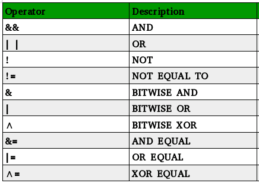

# c++ 中逻辑运算符的书面版本

> 原文:[https://www . geesforgeks . org/written-version-logic-operators-c/](https://www.geeksforgeeks.org/written-version-logical-operators-c/)

C++ 中可以用关键字代替运算符吗？
是的，当然可以。ANSI C++ 标准为几个 C++ 运算符提出了关键字。它们起源于标题<iso646.h>中的 C，当时还有键盘不能像& &、！，||等。
在 C++ 中，除了拼写之外，它们就像常规令牌一样变成了备用令牌。所以在解析**的时候，**和**&&**是完全一样的，只不过是拼写同一事物的方式不同而已。</iso646.h>

**考虑以下表达式:**

```cpp
x > y && m != 100,

can be replaced by:

x > y and m not_eq 100
```



```cpp
// C++ program to demonstrate 
// logical operator keywords
#include<iostream>
using namespace std;
int main()
{
    int x, y, z;
    x = 1;
    y = 0;
    z = 10;

    // Using keywords for || (or), && (and)
    if ((x or y) and y )
    {
        cout << "Hi, we are in if.";
    } 

    // Using keywords for ! (not), || (or), != (not_eq)
    else if (not y or x not_eq z)
    {
        cout << "Hi, we are in else if.";
    }
    return 0;
} 
```

输出:

```cpp
Hi, we are in else if.

```

与此类似，我们可以使用关键字来代替表中提到的所有运算符。

**福利-**

1.  运算符关键字增强了逻辑表达式的可读性。
2.  它们在键盘不支持某些特殊字符(如&、~和^)的情况下非常有用，因此我们可以使用关键字来代替它们。

**陷阱:**虽然，这是 C++ 非常令人兴奋的特性，但是一个人在使用它的时候需要谨慎一点。通常，在使用这些运算符时，我们可以在这些运算符之前或之后写变量，也可以不写，但是，当这些运算符被关键字替换时，必须在这些关键字之后和之前留一个空格，如下所示:

```cpp
// C++ program to demonstrate 
// logical operator keywords
#include<iostream>
using namespace std;
int main()
{
    int x, y;
    x = 1;

    // Wrong way to use compl for ~
    // y = complx;

    // Right way to use compl for ~
    y = compl x;

    cout << y;
    return 0;
}
```

输出:

```cpp
-2

```

**参考-**

1.  用 C++ 进行面向对象编程

本文由**姆里根德拉·辛格**供稿。如果你喜欢 GeeksforGeeks 并想投稿，你也可以使用[contribute.geeksforgeeks.org](http://www.contribute.geeksforgeeks.org)写一篇文章或者把你的文章邮寄到 contribute@geeksforgeeks.org。看到你的文章出现在极客博客主页上，帮助其他极客。

如果你发现任何不正确的地方，或者你想分享更多关于上面讨论的话题的信息，请写评论。